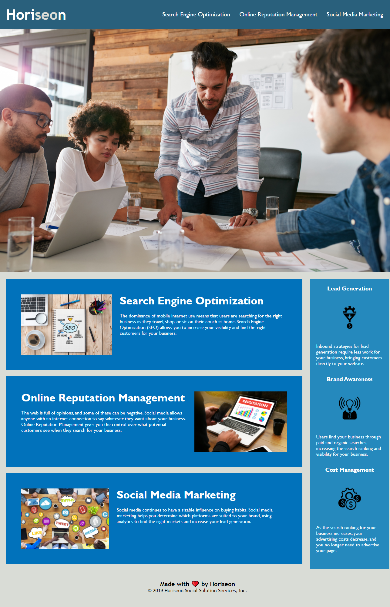

# challenge-1-horiseon-accessibility-correction

## Challenge Requirement
    * Comb through the 
 semantic tags in the html document & properly update them to HTML5 semantic tags readable by screen readers. 
    * Comb through the html code for links for accuracy and update if needed to ensure proper functionality.
    * Reveiw html tags & update where appropriate.
    * Add comments throughout the html and css file.
    * consolidate the css code to remove duplicate entries. 

## Final Website Screenshot
    

## Link to Horiseon Website
    [Horiseon](https://mjgiannelli.github.io/challenge-1-horiseon-accessibility-correction/)